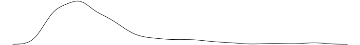
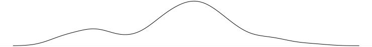

# 2. Univariate data

## Numeric summaries

### Center

- (**Sample) mean**: the balance point of the data, also known as the average. The mean is easily affected by outlier—unusually large or small—values

    $$\bar x = \frac{1}{n}\sum_i x_i$$

- **Trimmed mean**: to reduce the effect that outlier values, we can use the trimmed mean, that is, the mean without taking into account a certain percentage of the largest and smallest values.
- **Weighted average**: for some datasets, certain values may have a greater *weight* to them. For such cases we use the weighted average instead of the mean.

$$\sum_i \frac{x_i \cdot w_i}{\sum_j w_j}$$

- (**Sample) median**: it is the center point of the data, that is, the value for which there's an equal amount of values that are larger and that are smaller. If there's an odd amount of values we take this to be the one in the middle, if there's an even amount of values we take the mean to be the average between the two center values.

    The median is an alternative way to calculate the center of the data and, unlike the mean, is much more resilient to outlier values

    There is no such thing as a trimmed median, because by the nature of the median it will be the same if an equal amount of values are trimmed from the top and the bottom.

- **Mode**: rarely used, it is the value that is most common among the data, really only useful for discrete data.

### Position

- **Quantile**: the quantile is a generalization of the median. Whereas the median is the value for which $0.5$ of the values are lower and $1 - 0.5$ of the values are higher, the quantile can take an arbitrary point between $0$ and $1$. As such, the median can be taken to mean the $0.5$ quantile.
- **Percentile**: a percentile is essentially the same as a quantile, except that it's expressed in percentages rather than decimals between $0$ and $1$. The mean would be the 50th percentile.
- **Quartile**: quartiles divide the data into fourths, the zeroth, first, second, third, and fourth quartiles, often written as Q0 through 4, represent the 0th, 25th, 50th, 75th, and 100th percentiles.
- **Quintiles**: just like quartiles but they divide the data into fifths.
- **Hinges**: Similar but not equal to quartiles. They are found by applying the median to the data once to find the middle, and then again to the lower and higher halves to find the fourths.

### Spread

- **Range:** a naive measure of spread taken to be the difference between the largest and the lowest values.
- (**Sample) variance**: it is a measure of spread or deviation of data from the mean.

    $$\textit{sample variance} = s^2 = \frac{1}{n-1} \sum_i (x_i - \bar x)^2$$

- **(Sample) standard deviation or sd**: the standard deviation is another measure of spread, taken to be the square root of the variance. It has the advantage that it is on the same scale as the data.

    $$\textit{sample standard deviation} = \sqrt{s^2} = \sqrt{\frac{1}{n-1} \sum_i (x_i - \bar x)^2}$$

- **z-score**: The z-score gives us the size of a value in terms of its position relative to the center and the spread of the data. For example, a value of -3 tells us that the value is 3 standard deviations below the mean.

    $$\textit{z-score} = \frac{x_i - \bar x}{s}$$

    The following function tells us the value of a given z-score in terms of the units of the data

    $$\textit{value} = z s + \bar x$$

    For normally distributed data, there's the 68-95-99.7 rule of thumb, which states that 68% of the data will have an absolute z-score lower than 1, 95% will be lower than 2, and 99.7% will be lower than 3.

    For any data, regardless of distribution Chebyshev's theorem tells us that no more than $1/k^2$ of the data can have a z-score higher than $k$.

- **Coefficient of variation**: used to measure relative variability. It is not the same to have a standard deviation of 5 with a mean of 10, as it is to have that same standard deviation with a mean of 1000.

    $$\textit{coefficient of variation} = \frac{s}{\bar x}$$

- **IQR** or **interquartile range**: it is the range between Q1 and Q3. Unlike the standard deviation, the IQR is more resilient against outliers for the same reasons the median is more resilient to them than the mean. Comparison between the standard deviation and the IQR is difficult, though for normally distributed data the ratio of the IQR to the SD is around 1.35.

### Shape

- **Symmetry and skew**: symmetric data refers to data where the distribution of values is roughly similar on both sides of the mean. Skewed data is data where this is not the case, either side of the mean has a higher density of values.

    For symmetric data, the mean and the median are similar, while for skewed data the median is dragged to one side or the other of the mean, depending on whether the data is *right-skewed* (the median to the right of the mean) or *left-skewed* (with the median to the left).

    - **(Sample) skewness**: it is the numeric measure of the skew of the data.

        $$\textit{sample skewness} = \frac{1}{n}\sum_i z^3_i = \sqrt{n}\frac{\sum (x_i - \bar x)^3}{(\sum (x_i - \bar x)^2)^{\frac{3}{2}}}$$

        Where $z_i$ is the z-score

- **Tails**: tails characterize how many values are far from the bulk of the data. Long-tailed data, data with outliers very far from the mean, even when symmetric, can cause problems with the mean and the standard deviation, though trimming can prove useful for dealing with this.
    - **(Sample) excess kurtosis**:  it is a numeric measure of tails in the data

        $$\textit{sample excess kurtosis} = \frac{1}{n}\sum_i z^4_i - 3 = \sqrt{n}\frac{\sum (x_i - \bar x)^4}{(\sum (x_i - \bar x)^2)^2}$$

- **Modes**: given that the mode doesn't see much practical use for continuous data, we informally define a mode to mean an area where parts of the data tend to cluster.

    Below we see examples of *unimodal* and *bimodal* data, respectively:

    

    

### Visualization

- Dot plots
- Stem-and-leaf plots
- Histogram
- Density plots
- Boxplots
- Quantile graphs (against standard distribution)

## Categorical data

Summarizing univariate data is straightforward

- Tabulation
- Bar charts
- Dot charts
- Pie charts (don't)
