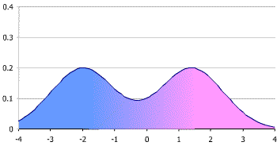
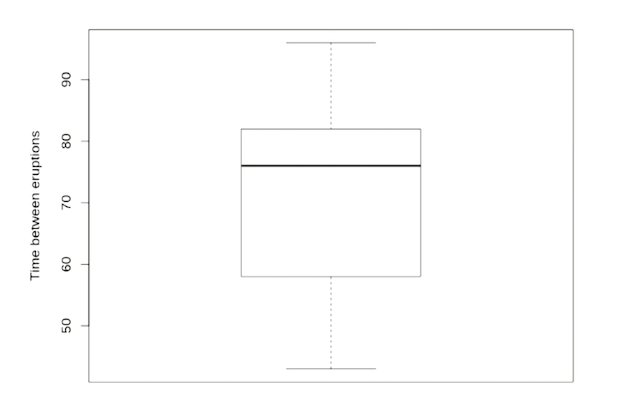

# 1B Exploratory data analysis

## Continuous data

#### Examples
- Length
- Weight
- Time

#### Representation
- **Single variable**
    - Histograms
    - Box-plots
    - Summary statistics (means, standard deviations, quantiles)
- **Multiple variables**
    - Scatter-plots
    - Correlations

## Categorical data

#### Examples
    TODO
#### Representation

- **Single variable**
    - Pie plot
    - Frequency table
- **Multiple variables**
    - Cross-tabulations

## R snippets
- **Frequency table**
    ```r
    table(central.park.cloud)
    #        clear       partly.cloudy        cloudy
    #          11             11                 9
    ```
- **Cross-tabulation**

    - Show relationship between categorical data
    ```r
    table(survey$Smoke, survey$Sex) # relation between smoking and sex    
    ##         Female Male
    ##   Heavy      5    6
    ##   Never     99   89
    ##   Occas      9   10
    ##   Regul      5   12
    ```
- **Mean**

    - Average of a collection of values
    - Not robust against outliers

    ```r
    x <- c(5,10)
  
    sum(x) / length(x)
    # 7.5
  
    mean(x)
    # 7.5
    ```
- **Median**

    - 'Middle' value of the data
    - Robust against outliers
    
    *For odd length data*
    ```r
    x <- c(10,5,15)
  
    sort(x)
    # 5 10 15
  
    median(x) 
    # 10
    ```
    *For even length data*
    ```r
    x <- c(10,5,15,20)
  
    sort(x)
    # 5 10 15 20
  
    median(x)
    # 12.5
  
    mean(c(10,15)) # median is same as mean of middle values
    # 12.5
    ```
- **Mode**
    - Most frequent value in the data
- **Variance** and **standard deviation**
    - Average squared distance (deviation) from the mean
    
    $\textit{VAR}(x)=s^2=\dfrac{(x_1-\bar{x})^2 + (x_2-\bar{x})^2+\dots+(x_n-\bar{x})^2}{n-1}$
    
    $sd(x)=\sqrt{s^2}=s$
    ```r
    mean(whale)
    # 152.4
  
    xbar <- mean(x)
    n    <- length(x)
  
    sum((x-xbar)^2) / (n-1)
    # 5113.378
  
    sd(whale)
    # 71.50789
    # an observation is approximately 72 away from the mean
    ```
- **Z-scores**
    ```r
    z <- (x-mean(x)) / sd(x) # or use built-in scale(x) function
    ```
    if we want to know if a value in `x` is larger
    than `1.2` standard deviations from the mean.
    ```r
    x[z > 1.2] 
    ```
    `z > 1.2` returns the indices of the values in `z` that are `> 1.2`
    the indices of the values in `x` correspond with those in `z`
    therefore the indices returned by `z > 1.2`
    can be used to retrieve the values from `x`.
- **Bimodal distribution**

    
    - Some representations hide the bimodal nature of a distribution; e.g. a boxplot.

        
